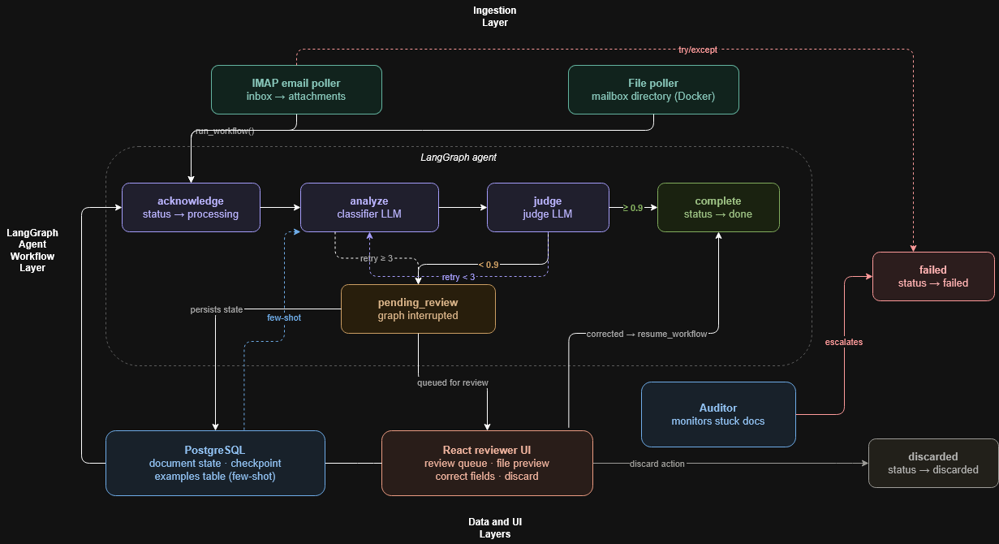

# AFO Agent — Automated Fund Operations Agent

AFO is an AI-powered document processing agent for Fund of Funds operations. It monitors a shared mailbox for incoming financial documents (invoices and capital calls), classifies them using GPT-4o-mini, validates extractions using GPT-4o as a judge, and routes them through a state-aware workflow with human-in-the-loop review for low-confidence or ambiguous documents.

Built with LangGraph, FastAPI, PostgreSQL, and React.

## Architecture



The system has three layers:

**Ingestion** — An IMAP poller runs as a background thread on startup, watching a Gmail label for unread emails with PDF or PNG attachments. Deduplicates against the database by `message_id` before triggering the workflow.

**LangGraph Agent Workflow** — A state machine with five nodes: `acknowledge → analyze → judge → complete | pending_review`. Routing is non-linear — `analyze` retries up to 3 times on transient errors, `judge` branches to `complete`, `pending_review`, or back to `analyze` based on confidence score and field completeness. The graph is compiled with a PostgreSQL checkpointer enabling interrupt/resume for human review.

**Data and UI** — PostgreSQL stores document state, LangGraph checkpoints, and few-shot examples from human corrections. The React UI provides a live document dashboard with filtering, file preview, and human review queue.

## Workflow

The agent workflow is implemented as a non-linear LangGraph state machine. Each node updates document state in PostgreSQL.

| State | Description |
|-------|-------------|
| `received` | Document ingested, workflow not yet started |
| `processing` | Workflow running |
| `completed` | Successfully classified and extracted |
| `pending_review` | Flagged for human review — low confidence, missing fields, or ambiguous document |
| `failed` | Unrecoverable error — corrupted file, workflow timeout |
| `discarded` | Human reviewer rejected the document |

**Routing logic (`_route`):**
- Error present + `retry_count < 3` → retry `analyze`
- Error present + `retry_count >= 3` → `pending_review`
- Any metadata field (`fund_name`, `amount`, `currency`, `due_date`) is `None` → `pending_review`
- `judge_score < 0.9` → `pending_review`
- All checks pass → `complete`

**Auditor** — A background thread runs every 60 seconds and marks any document stuck in `processing` for more than 30 seconds as `failed`, cleaning up the associated LangGraph checkpoint.

## Human-in-the-Loop (HITL)

When a document is routed to `pending_review`, the LangGraph graph pauses via `interrupt_after=["pending_review"]`. The document sits in the review queue until a human acts on it.

**Review** — The reviewer previews the original file, reads the judge's reasoning in the Notes column, and corrects any fields via the inline form. On submit, the PATCH endpoint:
1. Saves the correction to the `Examples` table
2. Calls `resume_workflow` which updates the graph state with `judge_score=1.0` and the corrected result
3. Re-runs `_route` which now routes to `complete`

**Discard** — Reviewer rejects the document entirely. Status set to `discarded`, LangGraph checkpoint deleted.

**Retry** — For `failed` documents, reviewer can trigger a fresh workflow run after inspecting the file.

**Self-improvement** — Corrections saved to the `Examples` table are injected as few-shot examples into the classifier prompt on subsequent runs. The human's reasoning (`human_reason`) is included alongside the corrected output, giving the model context for why the correction was made.

## Setup & Running

### Prerequisites
- Docker and Docker Compose
- OpenAI API key
- Gmail account with IMAP enabled and an App Password

### Environment Variables
Copy `.env.example` to `.env` and fill in:

```env
OPENAI_API_KEY=your_key_here
IMAP_HOST=imap.gmail.com
IMAP_USER=your@gmail.com
IMAP_PASSWORD=your_app_password
IMAP_FOLDER=afo-demo
LANGSMITH_API_KEY=your_key_here
LANGSMITH_TRACING=true
LANGSMITH_PROJECT=afo-agent
```

### LangSmith Tracing
LangSmith tracing is enabled by default when `LANGSMITH_TRACING=true` is set. All classifier and judge LLM calls are traced under the project specified in `LANGSMITH_PROJECT`. View traces at [smith.langchain.com](https://smith.langchain.com).

### Running

```bash
docker compose up --build
```

| Service | URL |
|---------|-----|
| React UI | http://localhost:5173 |
| FastAPI | http://localhost:8000 |
| API Docs | http://localhost:8000/docs |

### Gmail Setup
1. Enable IMAP in Gmail settings
2. Create an App Password under Google Account → Security
3. Create a label `afo-demo` in Gmail
4. Emails sent to the monitored account with PDF or PNG attachments will be processed automatically

## Self-Improvement Loop

When a human corrects a document in the review queue, the correction is saved to the `Examples` table alongside the original document text and the human's reasoning (`human_reason`). On subsequent classifier runs, these corrections are injected as few-shot examples into the prompt — showing the model not just the correct output but why it was correct.

The correction includes a `human_reason` field — a short note explaining why the correction was made (e.g. "wire deadline takes precedence over reconciliation date"). This reasoning is injected into the few-shot alongside the corrected output, giving the classifier context for the decision rather than just the answer. This is what makes the few-shot meaningful — the model learns the rule, not just the exception.

This means the system gets measurably better with each human correction. A document type that consistently trips the classifier will stop doing so after one correction is reviewed and saved.

The `Examples` table currently serves as the few-shot store. In production, once enough corrections accumulate, this dataset becomes a golden test set for fine-tuning the classifier — replacing few-shot prompting with a model that has internalized the corrections.

## Judge Prompt Engineering

The judge LLM (`gpt-4o`) validates classifier output before a document is marked `complete`. It scores confidence from 0 to 1 — documents scoring below 0.9 are routed to `pending_review`.

The judge prompt is continuously improved as new failure modes are discovered. Each version is tested against a growing set of documented test cases before deployment — new edge cases found in production become new test cases, and new prompt versions are validated against all prior cases before replacing the previous version.

| Version | Change |
|---------|--------|
| V1 | Baseline — scoring rubric only |
| V2 | Few-shot example for dual-purpose documents |
| V3 | Few-shot example for conflicting due dates |
| V4 | Few-shot example for partial payments |
| V5 | Instruction for unsupported document types |

Full test cases and version logs: [`prompts/prompt_engineering/judge.md`](prompts/prompt_engineering/judge.md)

## Design Decisions

**Temperature 0 on both LLMs** — Classifier and judge both run at `temperature=0` for deterministic output. Financial document processing requires reproducibility — the same document must produce the same result on every run. Non-zero temperature introduces variance that is unacceptable when extracting wire amounts and due dates.

**Two-LLM architecture** — A specialist classifier (`gpt-4o-mini`) handles extraction, a separate judge (`gpt-4o`) validates the output. Separation of concerns — the classifier is optimized for speed and cost, the judge is a more capable model focused purely on quality control. A single LLM self-validating its own output is less reliable than an independent second pass.

**Tool use as structured output enforcer** — Both LLMs are called with `tool_choice` forced to a specific function. This guarantees JSON schema-conformant output without post-processing. All fields are optional in the schema — the model returns `null` rather than hallucinating values it isn't confident about.

**LangGraph over ReAct** — ReAct gives an LLM autonomy to decide what actions to take next. For financial document processing, routing decisions must be deterministic and auditable — an LLM making routing choices introduces unpredictability in a domain where accuracy matters more than flexibility. LangGraph gives us the non-linear workflow and interrupt/resume capabilities of an agent framework with fully deterministic control flow.

**PostgreSQL checkpointer** — LangGraph's `PostgresSaver` persists graph state after every node. This means `pending_review` interrupts survive container restarts — a document paused for human review will still be resumable after a redeploy.

**`interrupt_after` over `interrupt_before`** — The graph interrupts after `pending_review` executes, not before. This ensures the DB status is updated to `pending_review` before the graph pauses — the document appears in the review queue immediately without needing a separate DB update outside the graph.

## API Reference

| Method | Endpoint | Description |
|--------|----------|-------------|
| `GET` | `/api/documents` | List all documents (excludes discarded) |
| `GET` | `/api/documents/{doc_id}` | Get a single document |
| `GET` | `/api/documents/{doc_id}/file` | Stream the original file for preview |
| `PATCH` | `/api/documents/{doc_id}/review` | Submit human corrections, resume workflow |
| `POST` | `/api/documents/{doc_id}/discard` | Discard a `pending_review` or `failed` document |
| `POST` | `/api/documents/{doc_id}/retry` | Retry a `failed` document |

Full interactive docs available at `http://localhost:8000/docs` when running.

## Project Structure

    afo-agent/
    ├── app/
    │   ├── agent.py          # LangGraph workflow, nodes, routing logic
    │   ├── classifier.py     # Specialist LLM — classification and extraction
    │   ├── judge.py          # Judge LLM — confidence scoring
    │   ├── auditor.py        # Background thread — detects and marks stale workflows
    │   ├── email_poller.py   # IMAP poller — watches Gmail label
    │   ├── poller.py         # File poller — watches mailbox/ (testing)
    │   ├── main.py           # FastAPI app, lifespan, endpoints
    │   ├── models.py         # SQLAlchemy and Pydantic models
    │   └── database.py       # DB engine, session factory
    ├── prompts/
    │   ├── classifier/       # Classifier prompt versions
    │   ├── judge/            # Judge prompt versions
    │   └── prompt_engineering/
    │       └── judge.md      # Judge test cases and version history
    ├── ui/
    │   └── src/
    │       ├── App.jsx
    │       └── components/
    │           ├── StatusBadge.jsx
    │           ├── MetricCard.jsx
    │           └── ReviewForm.jsx
    ├── docker-compose.yml
    ├── Dockerfile
    └── requirements.txt

## Future Improvements

- **Gmail API push notifications** — replace IMAP polling with Gmail API webhooks for real-time ingestion instead of polling every 10 seconds
- **Fine-tuning trigger** — once the `Examples` table reaches a threshold of corrections, automatically trigger a fine-tuning job on the classifier using the examples as a golden dataset
- **Classifier model upgrade** — swap `gpt-4o-mini` for a fine-tuned model as corrections accumulate, reducing reliance on few-shot prompting
- **Judge model separation** — in production the judge should be a more capable model than the classifier (e.g. `gpt-4o` vs a fine-tuned `gpt-4o-mini`)
- **Parallel classifier + judge** — run classifier and a preliminary judge check concurrently using async to reduce latency
- **Multi-attachment emails Edge Cases** — current implementation processes multiple attachments per email, but a crash  midway isn't handled cleanly, extend to handle emails with multiple attachments
- **Expanded document types** — add `distribution_notice`, `capital_account_statement` as supported types beyond `invoice` and `capital_call`
- **Status and document type enums** — replace plain string columns with PostgreSQL enums for `status` and `doc_type` to enforce valid values at the database level
- **Authentication** — the API currently has no authentication, suitable for internal demo use only. Production deployment would require API key or OAuth2 protection on all endpoints.
- **Horizontal scaling** — pollers and workflow runs are single-threaded. Production would require a task queue (Celery/Redis) to handle concurrent document processing across multiple workers.
- **Vision model for image documents** — Tesseract OCR quality degrades on low-resolution scans, rotated text, or handwritten annotations. Replacing OCR with direct GPT-4o vision inference for image files would improve extraction accuracy on poor-quality scans.


